# مکالمه‌بان — دستیار هوشمند فروش

مکالمه‌بان یک سامانه فارسی و راست‌چین برای دریافت، رونویسی، تحلیل و بازبینی تماس‌های فروش است. این محصول به سفارش شرکت فرازما توسعه داده شده است؛ نام محصول «مکالمه‌بان» است.

> وضعیت فعلی: `READY_FOR_INTERNAL_TESTING`
>
> نسخه A0/A1 از نظر کد پیاده‌سازی شده، اما تا پایان آزمون با تماس‌های واقعی فارسی، Backup/Restore واقعی و تست پایداری ۲۴ساعته و هفت‌روزه نباید «آماده پایلوت کنترل‌شده» معرفی شود.

## اجرای سریع روی Windows

### پیش‌نیاز

- Windows 10/11
- Docker Desktop همراه Docker Compose v2
- دسترسی اینترنت برای دریافت Imageها و استفاده از OpenAI
- کلید معتبر OpenAI برای پردازش واقعی صوت
- حداقل ۸ گیگابایت RAM پیشنهادی برای اجرای کامل سرویس‌ها

### راه‌اندازی پیشنهادی

1. Docker Desktop را اجرا کنید و منتظر بمانید تا آماده شود.
2. در پوشه پروژه روی `START_PROJECT.cmd` دوبار کلیک کنید.
3. در اجرای اول اطلاعات زیر را وارد کنید:
   - ایمیل و نام مدیر اولیه؛
   - رمز مدیر با حداقل ۱۰ کاراکتر و یک عدد؛
   - نام شرکت؛
   - کلید OpenAI.
4. راه‌انداز به‌صورت خودکار:
   - فایل محلی `.env` و رمزهای لازم را می‌سازد؛
   - سرویس‌های Docker را Build و اجرا می‌کند؛
   - آماده‌بودن API و رابط وب را کنترل می‌کند؛
   - سازمان و مدیر اولیه را می‌سازد؛
   - صفحه ورود را باز می‌کند.
5. در `http://localhost:3000/auth` با حساب مدیر وارد شوید.

اجرای اول به‌دلیل دانلود Imageها و Build سرویس‌ها طولانی‌تر است. توقف اسکریپت در مرحله Docker معمولاً یعنی Docker Desktop نصب نیست، هنوز آماده نشده یا WSL2 مشکل دارد.

### آدرس سرویس‌ها

| بخش | آدرس | کاربرد |
|---|---|---|
| داشبورد | `http://localhost:3000` | استفاده روزانه از محصول |
| صفحه ورود | `http://localhost:3000/auth` | ورود سازمانی با Keycloak |
| مستندات API | `http://localhost:8000/api/v1/docs` | تست و مشاهده API |
| سلامت API | `http://localhost:8000/health/ready` | بررسی آماده‌بودن Backend |
| سلامت Watcher | `http://localhost:8010/health/ready` | بررسی دریافت فایل تماس |
| Keycloak | `http://localhost:8081` | مدیریت احراز هویت |
| MinIO Console | `http://localhost:9001` | مدیریت فضای فایل‌های صوتی |

## محصول چگونه کار می‌کند؟

```mermaid
flowchart LR
    A["پوشه ضبط Issabel / Asterisk"] --> B["Watcher: پایداری، فرمت، SHA-256 و CDR"]
    B --> C["ذخیره امن صوت در MinIO و اطلاعات در PostgreSQL"]
    C --> D["صف Celery: پیش‌پردازش و رونویسی گوینده‌بندی‌شده"]
    D --> E["تحلیل فروش، KPI، اعتراض، فرصت و پیگیری"]
    E --> F["صف بازبینی انسانی و اصلاح"]
    F --> G["انتشار نسخه تأییدشده"]
    G --> H["داشبورد، گزارش PDF/Excel و پیگیری"]
```



1. **دریافت تماس:** فایل کامل‌شده از پوشه Local/Shared Folder مربوط به Issabel یا Asterisk خوانده می‌شود.
2. **کنترل ورودی:** Watcher منتظر پایدارشدن فایل می‌ماند، پسوند و سلامت آن را بررسی می‌کند، SHA-256 می‌سازد و فایل تکراری را دوباره پردازش نمی‌کند.
3. **تطبیق CDR:** اگر دسترسی فقط‌خواندنی CDR تنظیم شده باشد، اطلاعات تماس با `uniqueid` یا زمان/مبدأ/مقصد تطبیق داده می‌شود.
4. **ذخیره و پردازش:** صوت در MinIO ذخیره و Job در Celery صف می‌شود. Worker پیش‌پردازش، رونویسی، تفکیک گوینده و تحلیل فروش را انجام می‌دهد.
5. **ساخت خروجی اولیه:** متن زمان‌دار، نقش فروشنده/مشتری، نتیجه تماس، KPI، مشتری، محصول، مبلغ، اعتراض، فرصت و اقدام بعدی همراه شاهد ساخته می‌شود.
6. **بازبینی انسانی:** نتیجه AI ابتدا پیشنهاد است. بازبین صوت و متن را بررسی، نقش یا متن را اصلاح و نسخه را تأیید، رد یا برای اصلاح برمی‌گرداند.
7. **انتشار و گزارش:** فقط نسخه Published مبنای گزارش رسمی تیم قرار می‌گیرد. تاریخچه نسخه‌ها، اصلاحات و عملیات در Audit Log باقی می‌ماند.

## روش کار روزانه با محصول

### ۱. ورود و نمای کلی

پس از ورود، در «نمای کلی» تعداد تماس‌ها، وضعیت پردازش، امتیازها، پیگیری‌های عقب‌افتاده و هشدارهای عملیاتی را بررسی کنید. مشاهده خطای `403` یعنی نقش حساب برای آن بخش کافی نیست.

نقش‌های اصلی:

- `admin`: تنظیمات شرکت، کاربران، امنیت و تمام داده‌های سازمان؛
- `manager`: مدیریت تیم، گزارش‌ها و عملیات روزانه؛
- `supervisor`: بازبینی تماس و مدیریت پیگیری‌ها؛
- `seller` / `agent`: تماس‌ها و کارهای مجاز خود؛
- `viewer`: مشاهده بدون عملیات تغییردهنده.

### ۲. بررسی تماس‌ها

در صفحه تماس‌ها می‌توانید بر اساس فروشنده، تاریخ، نتیجه، شهر، محصول، امتیاز و وضعیت فیلتر کنید. وضعیت‌ها:

- `queued` یا `processing`: پردازش در جریان است؛
- `retry_scheduled`: خطای موقت رخ داده و اجرای بعدی زمان‌بندی شده است؛
- `review_needed`: نتیجه به بازبینی انسانی نیاز دارد؛
- `completed`: Pipeline تمام شده، اما صحت همه داده‌ها هنوز تضمین نشده است؛
- `failed`: پردازش پس از Retryها ناموفق بوده و مدیر باید خطا را بررسی کند؛
- `quarantined`: فایل ورودی خراب یا نامعتبر تشخیص داده شده است.

### ۳. بازبینی جزئیات تماس

در صفحه جزئیات:

1. صوت و Transcript زمان‌دار را هم‌زمان بررسی کنید.
2. نقش `seller/customer/unknown` و متن اشتباه را فقط با شنیدن همان بخش اصلاح کنید.
3. نام، شرکت، محصول، مبلغ، تاریخ و قول پیگیری را با شاهد زمانی تطبیق دهید.
4. نتیجه و KPI پیشنهادی را تأیید یا اصلاح کنید.
5. برای تحلیل دوباره بدون رونویسی مجدد از `reanalyze` استفاده کنید.
6. در مشکل اساسی صوت یا Transcript، پردازش `full` را ابتدا فقط روی یک تماس آزمایش کنید.
7. نسخه بازبینی‌شده را Publish کنید تا وارد گزارش رسمی شود.

اصلاح انسانی پاک نمی‌شود و در تاریخچه نسخه و Audit ثبت می‌گردد. اطلاعاتی که در صوت وجود ندارد نباید برای بهترشدن گزارش به تماس اضافه شود.

### ۴. پیگیری‌ها و پیام‌ها

- کارهای امروز، عقب‌افتاده، بدون موعد و انجام‌شده را تعیین تکلیف کنید.
- پیشنهاد AI را قبل از Assign یا Complete بررسی کنید.
- بازتحلیل یک تماس نباید پیگیری تکراری بسازد.
- تأیید پیش‌نویس پیام فقط تأیید داخلی است؛ نسخه فعلی ارسال واقعی SMS، WhatsApp یا Email انجام نمی‌دهد.

### ۵. گزارش و خروجی

- از جزئیات تماس، PDF یا خروجی‌های موردنیاز را دریافت کنید.
- از فهرست تماس‌ها، پس از تنظیم فیلترها Excel بگیرید تا خروجی فقط همان دامنه را داشته باشد.
- گزارش تیم فقط باید بر اساس نسخه‌های Published تفسیر شود.
- نتیجه AI بدون شاهد یا بازبینی انسانی نباید مبنای تصمیم قطعی فروش، حقوقی یا منابع انسانی قرار گیرد.

### ۶. کنترل روزانه مدیر

- وضعیت API و Watcher برابر `ready=200` باشد؛
- صف `retry_scheduled` یا `failed` رشد غیرعادی نداشته باشد؛
- تماس‌های `review_needed` و فایل‌های قرنطینه بررسی شوند؛
- پیگیری‌های عقب‌افتاده تعیین تکلیف شوند؛
- فضای MinIO و Docker کافی باشد؛
- آخرین Backup و checksum آن بررسی شود.

## تغییرات مهم نسخه A0/A1

- یکپارچه‌شدن مسیر داده عملیاتی روی FastAPI و PostgreSQL؛ Preview محلی از مسیر سرور جدا است.
- ورود OIDC/Keycloak، Refresh Token واقعی، نقش‌ها، عضویت سازمانی و غیرفعال‌سازی کاربر.
- جداسازی PostgreSQL مربوط به Keycloak و گسترش Backup/Restore برای PostgreSQL، MinIO و Keycloak.
- اعمال Row-Level Security برای داده‌های هر سازمان و محافظت از صوت با HTTP Range و Rate Limit.
- اضافه‌شدن نسخه‌های Immutable برای Transcript، تحلیل، شاهد و Artifact.
- اضافه‌شدن صف بازبینی انسانی، جلوگیری از self-review و گردش تأیید، رد، اصلاح و انتشار.
- اضافه‌شدن نسخه‌بندی Review و نمایش Draft/Published و تاریخچه نسخه در داشبورد.
- بهبود تشخیص گوینده و امکان اصلاح نقش بدون حذف تاریخچه.
- دریافت Shared Folder، کنترل فایل ناقص/تکراری/خراب، قرنطینه و تطبیق فقط‌خواندنی CDR.
- اضافه‌شدن خروجی‌های TXT، HTML، JSON، PDF و Excel همراه checksum.
- بهبود Retry خطاهای OpenAI، Storage و Database و نمایش وضعیت عملیات.
- اضافه‌شدن Retention روزانه، حذف سرتاسری داده و ابزارهای Backup/Restore و Load/Soak.
- حذف اتصال‌های عمومی CRM، Webhook، SMS، WhatsApp و Email از دامنه فعلی محصول؛ اتوماسیون موجود فقط داخلی است.
- اضافه‌شدن `START_PROJECT.cmd` برای راه‌اندازی خودکار محیط کامل روی Windows.

جزئیات وضعیت انتشار در [docs/RELEASE_STATUS.md](docs/RELEASE_STATUS.md) و محدودیت‌ها در [docs/KNOWN_LIMITATIONS.md](docs/KNOWN_LIMITATIONS.md) ثبت شده است.

## اتصال Issabel/Asterisk

سه روش ورودی پشتیبانی می‌شود: پوشه Local، Shared Folder و SFTP فقط‌خواندنی. نمونه SFTP برای سرور Issabel:

```dotenv
ISSABEL_IMPORT_MODE=sftp
ISSABEL_SFTP_HOST=IP-ISSABEL
ISSABEL_SFTP_USERNAME=readonly_user
ISSABEL_SFTP_PASSWORD="رمز-فقط-در-env-سرور"
ISSABEL_SFTP_REMOTE_PATH=/recordings
ISSABEL_CDR_HOST=IP-ISSABEL
ISSABEL_CDR_PORT=3306
ISSABEL_CDR_USERNAME=cdr_reader
ISSABEL_CDR_PASSWORD="رمز-فقط-در-env-سرور"
ISSABEL_CDR_DATABASE=asteriskcdrdb
ISSABEL_CDR_TABLE=cdr
ISSABEL_CDR_RECORDING_COLUMN=recordingfile
DEFAULT_TENANT_ID=UUID-شرکت
ISSABEL_DEFAULT_TENANT_ID=UUID-شرکت
```

`DEFAULT_TENANT_ID` و `ISSABEL_DEFAULT_TENANT_ID` باید دقیقاً برابر باشند. پیش از ورود فایل واقعی، ساخت مدیر اولیه و سازمان باید موفق شده باشد. کلید میزبان SSH باید در فایل `known_hosts` pin شود؛ راهنمای کامل در [docs/ISSABEL_INTEGRATION.md](docs/ISSABEL_INTEGRATION.md) قرار دارد.

## اجرای دستی محیط کامل

اگر نمی‌خواهید از راه‌انداز Windows استفاده کنید:

```powershell
Copy-Item .env.example .env
# رمزهای امن، OPENAI_API_KEY و مسیر Issabel را در .env تنظیم کنید

docker compose config --quiet
docker compose up -d --build
docker compose ps
docker compose run --rm api python -m app.bootstrap_admin
```

برای بررسی سلامت:

```powershell
Invoke-RestMethod http://localhost:8000/health/ready
Invoke-RestMethod http://localhost:8000/health/details
Invoke-RestMethod http://localhost:8010/health/ready
```

## مدیریت اجرا و داده

```powershell
# مشاهده وضعیت
docker compose ps

# مشاهده خطاهای اخیر
docker compose logs --since 10m api worker watcher web

# راه‌اندازی مجدد سرویس‌ها
docker compose restart

# توقف با حفظ داده
docker compose stop

# اجرای دوباره
docker compose up -d
```

داده‌های PostgreSQL، Redis، MinIO و Keycloak داخل Docker named volume نگهداری می‌شوند. از دستور `docker compose down -v` استفاده نکنید؛ گزینه `-v` داده‌های پایدار را حذف می‌کند.

## اجرای رابط محلی بدون Backend کامل

این حالت فقط برای توسعه و مشاهده رابط است و جای اجرای کامل محصول را نمی‌گیرد:

```powershell
cd web
npm.cmd install
npm.cmd run dev
```

سپس `http://localhost:3000` را باز کنید. در این حالت پردازش واقعی صوت، Worker، Issabel، Keycloak عملیاتی و گزارش Backend در دسترس نیستند.

> نکته حجم پروژه: `web/node_modules` ممکن است حدود ۸۰۰ مگابایت و `.venv` حدود ۲۰۰ مگابایت فضا مصرف کند. این پوشه‌ها در Git ثبت نمی‌شوند و قابل‌بازسازی‌اند. برای اجرای Docker نیازی به نصب dependencyها روی میزبان نیست.

## اجرای آزمون‌ها

آزمون جامع:

```powershell
powershell -ExecutionPolicy Bypass -File scripts/test_all.ps1
```

آزمون‌های مستقل پس از نصب dependencyهای توسعه:

```powershell
.venv\Scripts\python.exe -m pytest backend/tests -q
.venv\Scripts\python.exe -m pytest evaluation/tests scripts/tests load-tests/tests -q

cd web
npm.cmd run lint
npx.cmd tsc --noEmit
npm.cmd test
npm.cmd run build
```

## ساختار پروژه

- `web/`: رابط فارسی و RTL با Next.js/Vinext؛
- `backend/`: FastAPI، مدل‌ها، Migrationها، Celery و سرویس‌های پردازش؛
- `deploy/`: تنظیمات سرویس‌هایی مانند Keycloak؛
- `evaluation/`: ارزیابی WER/CER، عددها و موجودیت‌ها؛
- `scripts/`: راه‌اندازی، تست، Backup و Restore؛
- `load-tests/`: تست Load و Soak؛
- `sample-recordings/`: ورودی غیرحساس برای آزمایش Watcher؛
- `quarantine/`: محل فایل‌های ورودی نامعتبر در اجرای محلی؛
- `docs/`: مستندات معماری، استقرار، امنیت و راهنمای کاربران.

## امنیت و محدودیت‌های فعلی

- فایل `.env`، کلید OpenAI، رمز، Token و صوت واقعی را Commit نکنید.
- برای محیط عملیاتی `AUTH_DISABLED=false`، HTTPS، MFA و Secretهای یکتا الزامی‌اند.
- دسترسی CDR باید فقط‌خواندنی و دسترسی پوشه Issabel حداقلی باشد.
- SFTP Puller، ارسال خارجی پیام، CRM عمومی و جست‌وجوی معنایی کامل هنوز عملیاتی نیستند.
- دقت ۸۵٪ فقط پس از ارزیابی روی دیتاست واقعی و Transcript مرجع قابل ادعاست.
- Compose فعلی برای تست داخلی است؛ انتشار عمومی به Reverse Proxy، TLS و Keycloak در حالت Production نیاز دارد.

## مستندات تکمیلی

- [راهنمای کاربر](docs/USER_GUIDE.md)
- [راهنمای مدیر](docs/ADMIN_GUIDE.md)
- [استقرار](docs/DEPLOYMENT.md)
- [اتصال Issabel](docs/ISSABEL_INTEGRATION.md)
- [امنیت](docs/SECURITY.md)
- [Backup و بازیابی](docs/BACKUP_AND_RECOVERY.md)
- [معماری](docs/ARCHITECTURE.md)
- [محدودیت‌های شناخته‌شده](docs/KNOWN_LIMITATIONS.md)
- [وضعیت Release](docs/RELEASE_STATUS.md)
