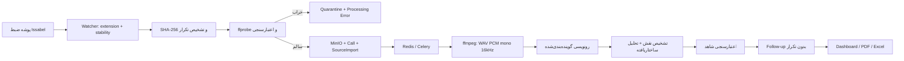

# معماری سامانه مکالمه‌بان

این سند وضعیت پیاده‌سازی نسخه پایلوت در ۱ اوت ۲۰۲۶ را توضیح می‌دهد. «فرازما» نام شرکت سفارش‌دهنده است؛ نام محصول **مکالمه‌بان، دستیار هوشمند فروش** است.

## اصل معماری: کمترین اصطکاک برای کاربر

سادگی استفاده یک الزام معماری و معیار پذیرش است. کاربر نهایی نباید برای ورود، پردازش تماس، بازبینی یا دریافت گزارش با Docker، دیتابیس، مدل AI یا جزئیات زیرساخت درگیر شود. عملیات رایج باید با یک اقدام روشن انجام شود، خطا باید فارسی و قابل‌حل باشد، وضعیت پردازش باید همیشه دیده شود و قابلیت غیرفعال باید دلیل و راه فعال‌سازی مشخص داشته باشد.

در محیط سرور، سادگی با دورزدن احراز هویت ایجاد نمی‌شود. ابزارهای راه‌اندازی و پنل مدیریت پیچیدگی PostgreSQL، Redis، MinIO، Keycloak و Worker را پشت مسیرهای هدایت‌شده پنهان می‌کنند. برای توسعه رابط، یک Preview محلی D1/R2 وجود دارد که فقط وقتی `OIDC_ISSUER` و `API_BASE_URL` تنظیم نشده‌اند و محیط Production نیست فعال می‌شود؛ این داده از محصول و پایلوت جدا است. روی Windows فایل `START_PROJECT.cmd` ورودی استاندارد اجرای کامل است.

## دو حالت اجرا

1. **پشته کامل Docker** مسیر مورد تأیید برای پایلوت است: Next/Vinext، FastAPI، PostgreSQL، Redis، Celery، MinIO، Keycloak و Watcher هم‌زمان اجرا می‌شوند و رونویسی/تحلیل واقعی انجام می‌شود.
2. اجرای `web` با `npm run dev` ورود، ساخت حساب، فضای کاری و API سبک D1/R2 را برای Preview رابط فراهم می‌کند. پردازش AI، Worker، Issabel و آزمون پایلوت در این حالت واقعی نیستند و این مسیر هرگز معیار پذیرش پایلوت محسوب نمی‌شود.

## اجزای اصلی

| جزء | مسئولیت | داده پایدار |
|---|---|---|
| `web` | رابط فارسی RTL، احراز هویت، داشبورد و پنل مدیریت | فقط از FastAPI نسخه‌دار |
| `api` | API نسخه‌دار، مجوزها، فیلتر، اصلاح، Retry و Export | PostgreSQL و MinIO |
| `watcher` | پایش پوشه Local/Shared، تشخیص پایداری فایل، hash، metadata و quarantine | PostgreSQL، MinIO و volume قرنطینه |
| `worker` | پیش‌پردازش، رونویسی، نقش‌دهی، تحلیل، اعتبارسنجی و پیگیری | PostgreSQL و MinIO |
| `postgres` | داده چندشرکتی، رخدادهای pipeline، خطاها، اصلاحات و extraction | volume `postgres-data` |
| `redis` | broker/result backend سلری | volume `redis-data` |
| `minio` | فایل صوتی اصلی | volume `minio-data` |
| `keycloak` | OIDC، توکن و حساب‌های اجرای کامل | در Compose فعلی persistence خارجی برای Keycloak تعریف نشده است |

## جریان یک تماس Issabel

Watcher فایل‌های با پسوند موقت را نادیده می‌گیرد و فقط وقتی اندازه و `mtime` در دو مشاهده ثابت بماند و مدت `ISSABEL_FILE_STABILITY_SECONDS` بگذرد آن را وارد می‌کند. دو unique constraint بر `source_identifier` و `sha256` مانع واردکردن دوباره در سطح هر tenant می‌شوند.

## ماشین وضعیت و بازیابی

واژگان استاندارد وضعیت شامل این مقادیر است:

`discovered → waiting_for_file → queued → preprocessing → diarizing/transcribing → assigning_roles → analyzing → validating → creating_followups → completed/review_needed`

و حالت‌های خطا `retry_scheduled`، `failed` و `quarantined` هستند. رخدادها در `pipeline_events`، خطاهای امن در `processing_errors` و آخرین مرحله موفق و شمارنده retry روی تماس ذخیره می‌شوند. Worker فعلی همه واژه‌های بالا را پشتیبانی می‌کند، ولی برای تماس تک‌کاناله مرحله diarization در سرویس خارجی رونویسی انجام می‌شود و الزاماً رخداد جداگانه `diarizing` تولید نمی‌شود.

خطای transient با برنامه قابل تنظیم `30,120,600,1800,7200` ثانیه و jitter دوباره اجرا می‌شود. خطای دائمی به `failed` یا برای ورودی خراب به `quarantined` می‌رود. حالت‌های پردازش مجدد:

- `resume`: ادامه عادی و عدم پردازش دوباره تماس تکمیل‌شده؛
- `reanalyze`: استفاده از متن ذخیره‌شده و حفظ اصلاح انسانی؛
- `full`: اجرای کامل دوباره از صوت.

## تحلیل، شاهد و اصلاح انسانی

- متن به قطعات دارای speaker، نقش، زمان شروع و پایان ذخیره می‌شود.
- نقش‌ها ابتدا با heuristic و بعد با ارزیابی ساختاریافته مدل تعیین می‌شوند.
- اطلاعات مشتری/فروش شامل نام، تلفن، شرکت، شهر، استان، محصول، مبلغ، پیگیری، مرحله فروش و سایر فیلدها در `call_extractions` ذخیره می‌شود.
- هر استخراج مهم باید شاهدی با segment، quote و timestamp داشته باشد. validator شاهد نامعتبر را قطعی نمایش نمی‌دهد و تماس کم‌اطمینان به `review_needed` می‌رود.
- اصلاح متن/نقش در `transcript_corrections` ثبت می‌شود؛ مسیر re-analysis نباید متن `manually_corrected` را overwrite کند.
- پیگیری با `dedupe_key` یکتا ساخته می‌شود تا reprocessing وظیفه تکراری نسازد.

این کنترل‌ها احتمال hallucination را کاهش می‌دهند، اما صفر بودن آن فقط با تست دیتاست واقعی و بازبینی انسانی قابل اثبات است.

## چندشرکتی و کنترل دسترسی

داده‌های کسب‌وکاری `tenant_id` دارند. API tenant را از توکن OIDC می‌گیرد، session دیتابیس را با `app.tenant_id` تنظیم می‌کند و RLS در PostgreSQL جداسازی را تقویت می‌کند. نقش‌ها `admin`، `manager`، `supervisor`، `seller`، `agent` و `viewer` هستند. کنترل endpoint و RLS هر دو لازم‌اند؛ `AUTH_DISABLED=true` فقط در محیط توسعه مجاز است.

## مشاهده‌پذیری

- API: `/health/live`، `/health/ready`، `/health/details` و `/metrics`
- Watcher روی پورت 8010: `/health/live`، `/health/ready` و `/metrics`
- Docker healthcheck برای API، Worker، Watcher و Web
- log rotation در Compose با حداکثر پنج فایل ۱۰MB برای هر کانتینر

وجود endpoint سلامت به‌تنهایی معادل مانیتورینگ نیست؛ برای پایلوت باید scraper، داشبورد و هشدار خارجی تنظیم شود.
